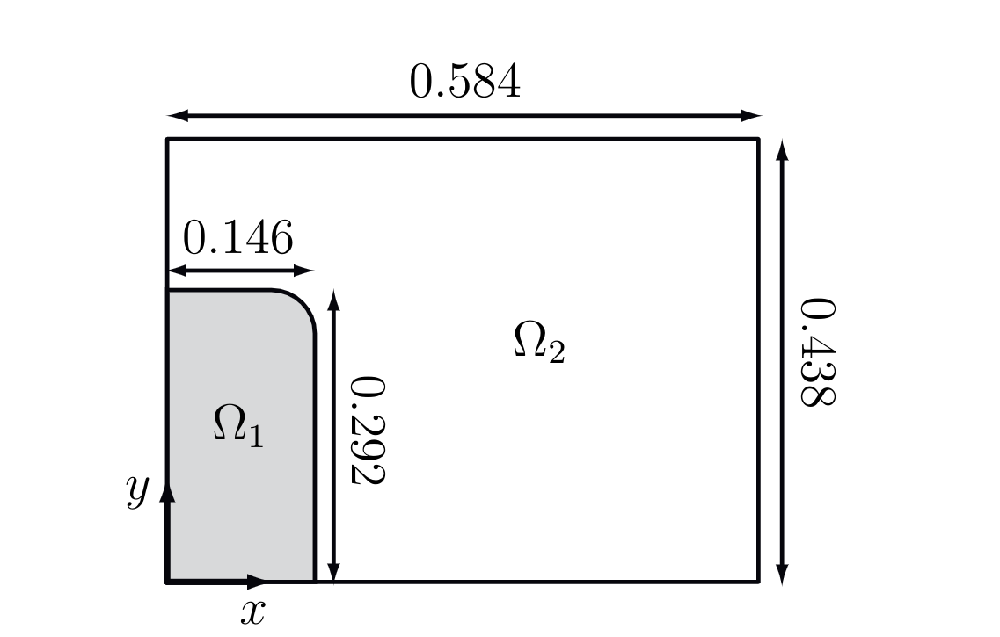

# 溃坝问题

    	 

参数设置:
$$
\mu_{water} = 1 \times 10^{-3}kg/m/s,\mu_{air} = 1 \times 10^{-5}kg/m/s ,\\
\rho_{water} = 1000kg/m^3,\rho_{air} = 1kg/m^3 ,\\
\boldsymbol f = (0,-g), g=9.81m/s^2
$$
边界条件,墙壁设置为无滑移边界条件
$$
\boldsymbol u |_{wall} = 0
$$
上边界取为open
$$
p=0 ,\nabla u=0
$$

界面
$$
[\boldsymbol u]_{\Gamma} = 0,\boldsymbol n \cdot [\boldsymbol \sigma]_{\Gamma} = 0,
$$

## NS

$$
\begin{aligned}
\rho (\frac{\partial \boldsymbol u}{\partial t} +
\boldsymbol u \cdot \nabla \boldsymbol u -\boldsymbol f) + \nabla p - 
\mu \nabla \cdot (\nabla \boldsymbol u + \nabla \boldsymbol u^T) = 0 \\
\nabla \cdot \boldsymbol u =0 
\end{aligned}
$$

时间离散如下
$$
\begin{aligned}
\rho (\frac{\boldsymbol u^* - \boldsymbol u^n}{\Delta t} +
\boldsymbol u^n \cdot \nabla \boldsymbol u^n -\boldsymbol f^{n+1}) + \nabla p^n - \\
\frac{1}{2}\mu \nabla \cdot (\nabla \boldsymbol u^* + 
\nabla \boldsymbol (\boldsymbol u^*)^T) -
\frac{1}{2}\mu \nabla \cdot (\nabla \boldsymbol u^n + 
\nabla \boldsymbol (\boldsymbol u^n)^T)= 0 \\
\rho\frac{\boldsymbol u^{n+1} - \boldsymbol u^*}{\Delta t} - \nabla p^n
+\nabla p^{n+1} = 0\\
\nabla \cdot \boldsymbol u^{n+1} =0\\
\end{aligned}
$$
对上面第二个式子两边求散度得
$$
\begin{aligned}
\rho (\frac{\boldsymbol u^* - \boldsymbol u^n}{\Delta t} +
\boldsymbol u^n \cdot \nabla \boldsymbol u^n -\boldsymbol f^{n+1}) + \nabla p^n \\ 
-
\frac{1}{2}\mu \nabla \cdot (\nabla \boldsymbol u^* + 
\nabla \boldsymbol (\boldsymbol u^*)^T) -
\frac{1}{2}\mu \nabla \cdot (\nabla \boldsymbol u^n + 
\nabla \boldsymbol (\boldsymbol u^n)^T)= 0 \\ 
\Delta (p^{n+1} - p^{n}) - \frac{\rho}{\Delta t} \nabla \cdot \boldsymbol u^* = 0\\
\frac{\rho}{\Delta t} \boldsymbol u^{n+1} = \frac{\rho}{\Delta t} \boldsymbol u^* + \nabla p^n - \nabla p^{n+1}
\end{aligned}
$$
空间离散

第一步
$$
\begin{aligned}
\frac{1}{\Delta t}(\rho \boldsymbol u^*,\boldsymbol w) + \frac{1}{2}(\mu(\nabla \boldsymbol u^* + \nabla (\boldsymbol u^*)^T),\nabla \boldsymbol w) - \frac{1}{2}\mu(\nabla \boldsymbol u^* \cdot \boldsymbol n, \boldsymbol w)_{\partial \Omega}=\\
(\rho \boldsymbol f^{n+1},\boldsymbol w) +\frac{1}{\Delta t}(\rho \boldsymbol u^n,\boldsymbol w) - (\rho\boldsymbol u^n \cdot \nabla \boldsymbol u^n ,\boldsymbol w)+\\(p^n \boldsymbol I, \nabla \boldsymbol w) - (p^n \boldsymbol n,\boldsymbol w)_{\partial \Omega}-\frac{1}{2}(\mu(\nabla \boldsymbol u^n + \nabla (\boldsymbol u^n)^T),\nabla \boldsymbol w) + \frac{1}{2}\mu(\nabla \boldsymbol u^* \cdot \boldsymbol n,\boldsymbol w)_{\partial \Omega}
\end{aligned}
$$
第二步
$$
(\nabla p^{n+1},\nabla q) =  -\frac{1}{\Delta t}(\rho \nabla \cdot \boldsymbol u^*,q)+(\nabla p^{n},\nabla q)
$$
第三步
$$
\frac{1}{\Delta t} (\rho \boldsymbol u^{n+1},\boldsymbol w) = \frac{1}{\Delta t} (\rho\boldsymbol u^*,\boldsymbol w)  - ((\nabla (p^{n+1} - p^n) ,\boldsymbol w)
$$
