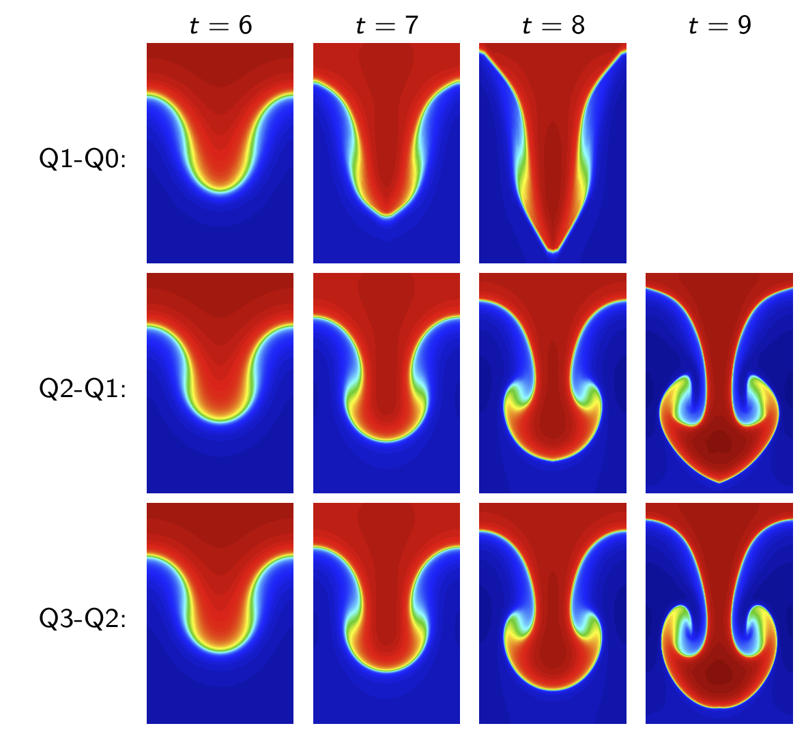

#  流体高阶有限元

##简介
首先网格区域在lagrange框架下，是基于例子位置来定义的
(每个节点相当与一粒子，随着时间来改变)，因此可以定义移动网格

		 

高阶有限元，增加每个单元的自由度来提高有限元基函数的次数

    	 

##优势
提高了模拟的准确性，并为极端并行计算和百亿亿次架构提供了可行的路径。

高阶有限元方法，增加每个计算单元(或区域)的额外自由度来增加模拟的精度和稳健性，

    	 

高阶方法允许问题运行更长时间并解决更多的流特征

    	 

高阶拉格朗日计算与 AMR-ALE 结果吻合良好

    	 

例如，在上图中，使用Q8-Q7有限元(运动场八阶多项式，热力学场七阶多项式)展示了一个多材
料冲击流体力学问题的高阶计算。高阶有限元可以带来激波的高度弯曲区域和次区域分辨率，
这是低阶方法根本不可能做到的

因为高阶方法在区域级别上计算更密集，通信开销不像低阶算法那样显著;
因此，在每个处理器的单个计算区域的限制下，有可能实现优秀的强扩展结果。

使用精确解生成初始笛卡尔网格,高阶曲线有限元使用额外的自由度来更准确地表示
问题中的初始曲率和自然发展曲率

    	 

优势

- 更准确地使用曲线区域捕获流量区域的几何特征。
- 高阶空间精度
- 支持 ODE 系统的一般高阶时间离散化
- 精确的保证能量守恒
- 运动学和热力学空间选择的一般性
- 不需要特别的 ad-hoc hourglass filters.
- 更清晰的冲击波前分辨率。冲击可以在单个区域内表示
- Substantial reduction in mesh imprinting
