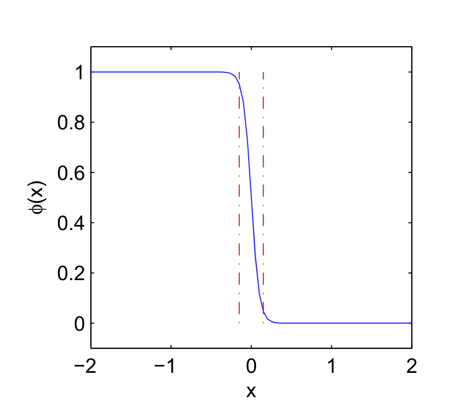

# 守恒的水平集方法及其离散

考虑区域 $\Omega \in \mathbb R^n$ ,令 $\Omega_1 \in \Omega , \Omega_2 = \Omega \backslash \Omega_1$,
则界面可以表示为所有闭子域的交集
$$
\Gamma = \{ \boldsymbol x : \boldsymbol x \in \bar{\Omega_1} \cap \bar{\Omega_2} \}
$$

由于经典的水平集算法缺乏质量守恒,即两边区域的面积可能会发生改变,因此很少应用与两相流界面的计算,为了克服这种问题,提出下面这种算法.

为保持质量守恒,我们将 $\nabla \cdot \boldsymbol u$ 带入演化方程,因此演化方程变为
$$
\begin{aligned}
\frac{\partial \varphi}{\partial t}+\nabla (\varphi \boldsymbol u )= 0
\end{aligned}
$$

水平集函数不再选取符号距离函数,而是用Heaviside函数来替代,

$$
\varphi(\boldsymbol x) = \frac{1}{1 + e^{-d\boldsymbol(\boldsymbol x)/\epsilon}}
$$

    	 

$d(\boldsymbol x)$ 为符号距离函数,参数 $\epsilon$ 用来平滑物理性质的转变,
也叫做界面厚度(过渡区域厚度为 $6 \epsilon$)

这时候界面的隐形式变为

$$
\Gamma = \{\boldsymbol x: \varphi(\boldsymbol x) = 0.5\}
$$

为了保持Heaviside函数的性质,我们也需要重置这个函数

$$
\frac{\partial \varphi}{\partial \tau}(\boldsymbol x,\tau) 
+ \nabla \cdot [\varphi(1-\varphi)\boldsymbol n_{\tau}] = 
\epsilon \nabla \cdot [\boldsymbol n_{\tau} 
(\nabla \varphi \cdot \boldsymbol n_{\tau} )]
$$

其中

$$
\boldsymbol n_{\tau} = \frac{\nabla \varphi(\boldsymbol x,\tau = 0)}
{\|\nabla \varphi(\boldsymbol x,\tau = 0)\|}
$$

为指向界面的单位向量.

## 演化方程数值方法

首先空间上用有限元来离散的得到

$$
(\varphi_t ,w) = (\varphi ,\boldsymbol u \cdot \nabla w)
$$

时间离散有有以下三种方法

- Eular

$$
(\phi^{n+1},w) = 
(\phi^n,w) + \Delta t(\phi^n , \nabla w \cdot \boldsymbol u)
$$

- Crank-Nicholson

$$
(\varphi^{n+1},w) - \frac{\Delta t}{2}(\varphi^{n+1},\nabla w \cdot \boldsymbol u)= 
(\varphi^n,w) + \frac{\Delta t}{2}(\varphi^n , \nabla w \cdot \boldsymbol u)
$$

- SUPG

CK离散优于Eular,但是由于其不满足迎风的性质,将会导致解的震荡.
在原本的演化方程中加入残差项,来避免这个问题

$$
r = \varphi_t + \boldsymbol u \cdot \nabla \varphi
$$

因此变为

$$
(\varphi_t + \nabla \cdot (\varphi \boldsymbol u),w) + (s,r)= 0
$$

其中

$$
s = \frac{h}{2\|\boldsymbol u\|}(\boldsymbol u \cdot \nabla w)
$$

$h$ 为单元尺寸,因此其弱形式可以写为

$$
\begin{aligned}
(\varphi^{n+1},w) 
- \frac{\Delta t}{2}(\phi^{n+1},\nabla w \cdot \boldsymbol u)
+ (\varphi^{n+1},s) 
+ \frac{\Delta t}{2}(s,\nabla \varphi^{n+1} \cdot \boldsymbol u)= \\ 
(\varphi^n,w) + \frac{\Delta t}{2}(\phi^n , \nabla w \cdot \boldsymbol u)
+ (\varphi^{n},s) - \frac{\Delta t}{2}(s,\nabla \varphi^{n} \cdot \boldsymbol u)= 
\end{aligned}
$$

## 重置函数的离散

关于重置函数首先进行空间上的有限元离散,得到
$$
(\frac{\partial \varphi}{\partial \tau},w) =
( \varphi(1-\varphi),\nabla w \cdot \boldsymbol n_{\tau})  
- \epsilon (\nabla \varphi \cdot \boldsymbol n_{\tau}, 
\nabla w \cdot \boldsymbol n_{\tau})
$$

时间离散用CN,由于有非线性项,还需要一个简单的线性化

$$
\begin{aligned}
\frac{1}{\Delta \tau}(\varphi^{n+1}-\varphi^n,w) &= 
(\frac{\varphi^{n+1}+\varphi^n}{2}(1-\frac{\varphi^{n+1}+\varphi^n}{2}),
\nabla w \cdot  \boldsymbol n_{\tau}) - 
\frac{\epsilon}{2}(\nabla(\varphi^{n+1}+\varphi^n)\cdot  \boldsymbol n_{\tau},
\nabla w \cdot  \boldsymbol n_{\tau}) \\
& \approx 
(\frac{\varphi^{n+1}-\varphi^n}{2}-\varphi^{n+1}\varphi^n,
\nabla w \cdot  \boldsymbol n_{\tau}) - 
\frac{\epsilon}{2}(\nabla(\varphi^{n+1}+\varphi^n)\cdot  \boldsymbol n_{\tau},
\nabla w \cdot  \boldsymbol n_{\tau}) 
\end{aligned}
$$

重新调整一下得到

$$
\begin{aligned}
(\varphi^{n+1},w) -
\frac{\Delta \tau}{2}(\varphi^{n+1},\nabla w \cdot \boldsymbol n_{\tau}) + 
\frac{\epsilon \Delta \tau}{2}(\nabla \varphi^{n+1} \cdot \boldsymbol n_{\tau} ,
\nabla w \cdot \boldsymbol n_{\tau}) +
\Delta \tau (\varphi^{n+1}\varphi^n,
\nabla w \cdot \boldsymbol n_{\tau}) \\
= 
(\varphi^{n},w) + \frac{\Delta \tau}{2}(\varphi^{n},
\nabla w \cdot \boldsymbol n_{\tau}) - 
\frac{\epsilon \Delta \tau}{2}(\varphi^{n} \cdot \boldsymbol n_{\tau} ,
\nabla w \cdot \boldsymbol n_{\tau}) 
\end{aligned}
$$
