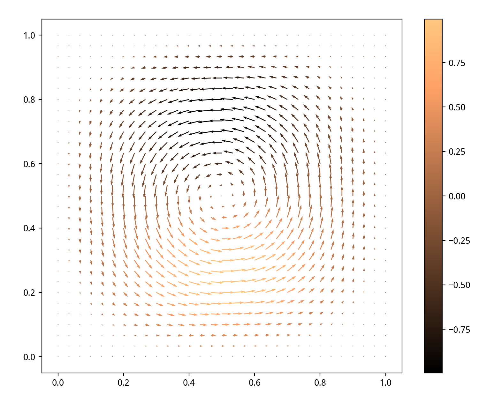
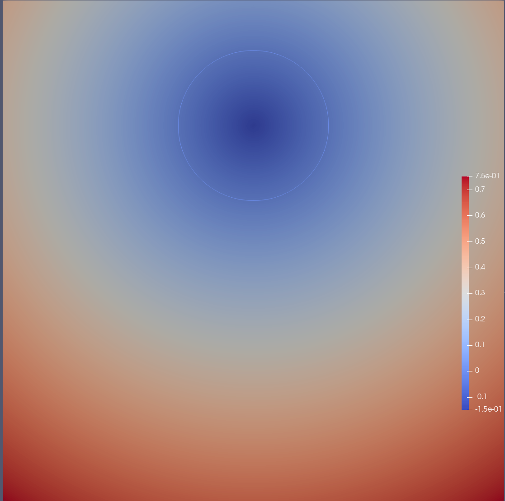

# 水平集(Level set)

给定一个实值函数 $f(\boldsymbol x)$, 其定义域为 $\Omega\subset\mathbb R^n$.
进一步给定常数 $c$, 则可定义点集

$$
\Gamma_c = \{\boldsymbol x \in \Omega | f(\boldsymbol x) = c\},
$$

称集合 $\Gamma_c$ 为 $f(\boldsymbol x)$ 的**水平集**，如果 $c$ 取 0, 则称 
$\Gamma_0$ 为 $f(\boldsymbol x)$ 的**零水平集**.
$f(\boldsymbol x)$ 就称为相应的**水平集函数**.

如果函数的定义是二维空间, 则水平集还可称为**水平曲线(level curve)**, 
或者**等值线(contour line or isoline)**.

如果函数定义域是三维空间, 则水平集还可称为**水平曲面(level surface)**,
或者**等值面(isosurface)**

如果是更高维空间, 则水平集还可称为**水平超曲面(level hypersurface)**. 

实际上, 水平集是 **纤维(fiber)** 这个数学概念的特例,
有兴趣的读者可以查一查.

介绍水平集函数的基本概念、示例和演示代码.

* 背景
* 基本概念
    - 水平集函数
    - 零水平集
    - 符号距离函数
    - Heaviside 函数
* 示例与代码
* 参考文献

## 基础

水平集方法是刻画界面演化的一种有效方法.考虑区域 $\Omega \in \mathbb R^n$ ,令 $\Omega_1 \in \Omega , \Omega_2 = \Omega \backslash \Omega_1$

则界面可以表示为所有闭子域的交集

$$
\Gamma = \{ \boldsymbol x : \boldsymbol x \in \bar{\Omega_1} \cap \bar{\Omega_2} \}
$$

界面演化通过如下的传输方程来隐式的表达

$$
\frac{\partial \varphi}{\partial t}+\boldsymbol u \cdot \nabla \varphi = 0
$$

其中 $\boldsymbol u$ 为速度场, $\varphi$ 为水平函数,用来表达界面的位置,水平集函数有很多中不同的选取方式

## 水平集函数

- 符号距离函数

$$
\begin{aligned}
d(\boldsymbol x ) =
\begin{cases}
\min_{\boldsymbol x_i \in \Gamma}
\| \boldsymbol x -\boldsymbol x_i\| , x \in \Omega_1 \\
-\min_{\boldsymbol x_i \in \Gamma}
\| \boldsymbol x -\boldsymbol x_i\| , x \in \Omega_2 \\
\end{cases}
\end{aligned}
$$

- Heaviside函数

$$
H(x) = 
\begin{cases}
0 ,\quad x \in \Omega_1\\
\frac{1}{2},\quad x \in \Gamma\\
1,\quad x \in \Omega_2
\end{cases}
$$

    	 

## Benchmark

给定速度场 $\boldsymbol u = (u,v)$

$$
\begin{aligned}
u = \sin^2(\pi x) \sin(2 \pi y)\\
u = -\sin^2(\pi y) \sin(2 \pi x)\\
\end{aligned}
$$

    	 

初始界面为半径为0.15,位置在$(0.5,0.75)$的圆,其距离函数为

    	 

