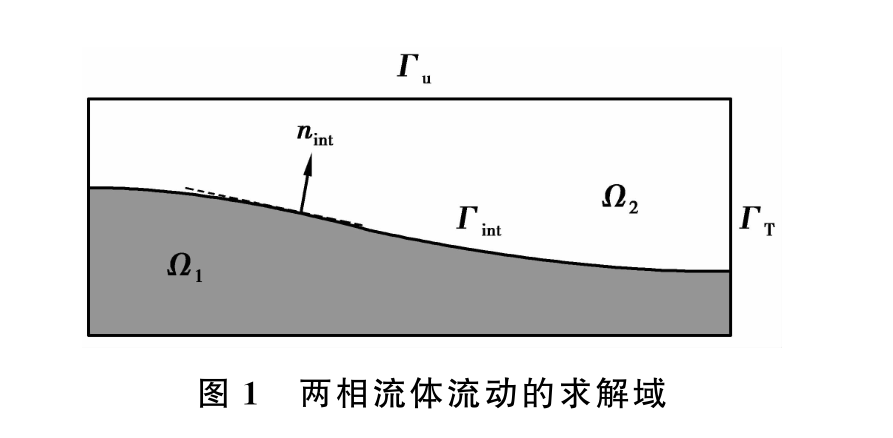
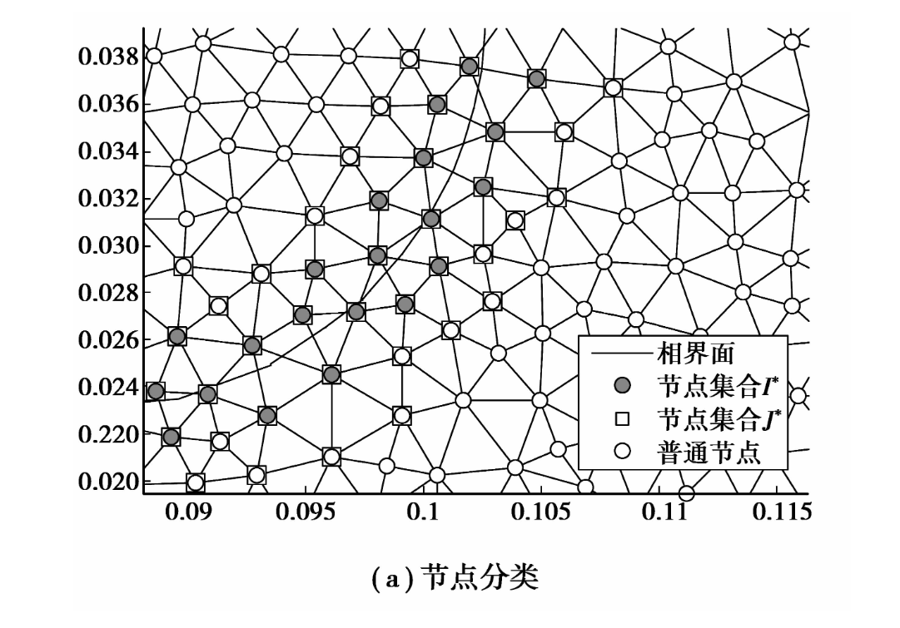
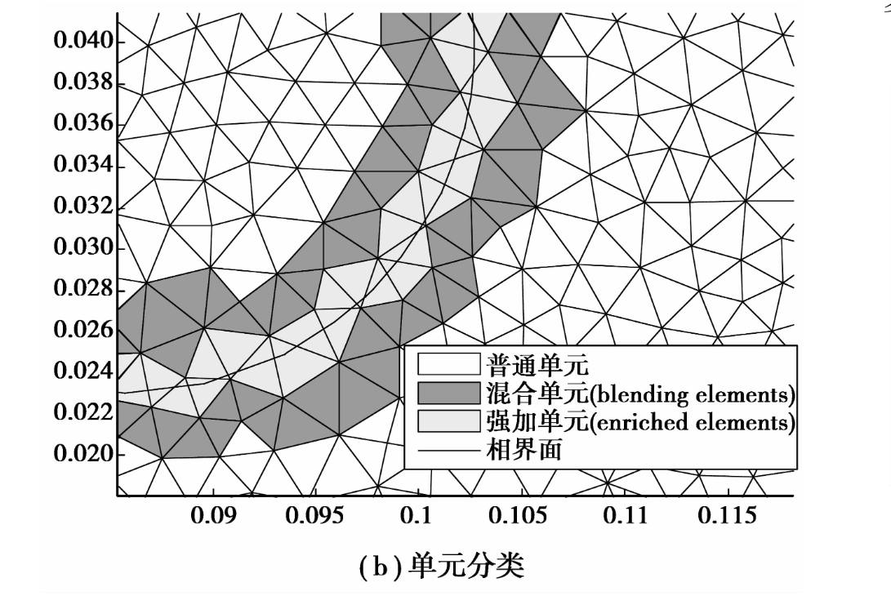
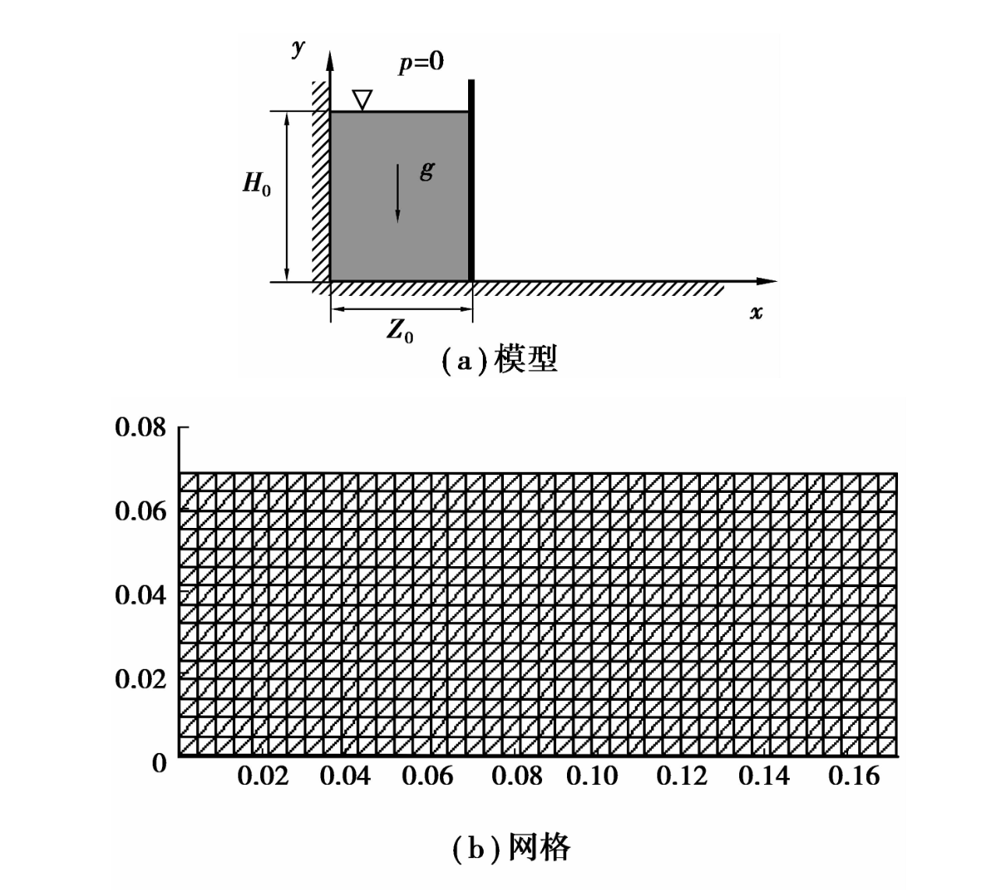

# 两相流动问题

## 控制方程

    	 

流体的控制方程为ＮＳ方程

$$
\begin{aligned}
&\begin{cases}
\rho (\frac{\partial \boldsymbol u}{\partial t} 
+ \boldsymbol u \cdot \nabla \boldsymbol u - \boldsymbol f) 
- \nabla \cdot \boldsymbol \sigma = 0 \\ 
\nabla \cdot \boldsymbol u = 0 \\
\boldsymbol u (\boldsymbol x,t) = 
\boldsymbol u_D \quad \forall \boldsymbol x  \in \Gamma_u \\
\boldsymbol n \cdot \boldsymbol \sigma (\boldsymbol x,t) = 
\boldsymbol u_N \quad \forall \boldsymbol x  \in \Gamma_t\\
\end{cases} \\
&\text{其中}\\
&\begin{cases}
\boldsymbol \sigma = \boldsymbol \tau - p \boldsymbol I \\
\boldsymbol \tau = 2\mu\boldsymbol D , 
\boldsymbol D = \frac{1}{2}(\nabla \boldsymbol u + (\nabla \boldsymbol u)^T) 
\end{cases}
\end{aligned}
$$

符号意义为

- $\rho$ :流体密度
- $\boldsymbol u$ :速度场
- $\boldsymbol f$ :附加重力项
- $\boldsymbol \sigma$ :柯西应力
- $\boldsymbol \tau$ :偏斜应力
- $p$ :静水压力
- $\mu$ : 粘性系数

在忽略表面张力下，应力和速度在相界面要满足

$$
\begin{aligned}
\left[ \boldsymbol n_{int} \cdot \boldsymbol \sigma \right] = 0 \\
\left[ \boldsymbol u \right] = 0
\end{aligned}
$$

对于两相流体，$\rho$ 和 $\tau$ 定义如下:

$$
\begin{aligned}
\rho(\phi) = 
\begin{cases}
\rho_1 \qquad \phi \geq 0 \\
\rho_2 \qquad \phi < 0 \\
\end{cases}
\qquad\forall \boldsymbol x \in \Omega \\
\mu(\phi) = 
\begin{cases}
\mu_1 \qquad \phi \geq 0 \\
\mu_2 \qquad \phi < 0 \\
\end{cases}
\qquad\forall \boldsymbol x \in \Omega \\
\end{aligned}
$$

其中 $\phi$ 为水平集函数，用于跟踪两需相流的界面

$$
\begin{aligned}
\phi(\boldsymbol x,t) = 
\begin{cases}
< 0 \qquad\forall \boldsymbol x \in \Omega_1 \\
= 0 \qquad\forall \boldsymbol x \in \Gamma_{int} \\
> 0 \qquad\forall \boldsymbol x \in \Omega_2 \\
\end{cases}
\end{aligned}
$$

## 水平集函数界面刻画

水平集函数可以用距离函数描述，其定义为:

$$
\begin{aligned}
\phi(\boldsymbol x , t) = 
\pm \min_{\boldsymbol x^* \in \Gamma_{int}} \| \boldsymbol x -\boldsymbol x^*  \|
\end{aligned}
$$

再通过运输方程来追踪界面

$$
\begin{aligned}
&\frac{\partial \phi}{\partial t} + 
c(\phi) \boldsymbol u \cdot \nabla\ \phi = 0 \\
&c(\phi) = 
\begin{cases} 
1  \qquad &|\phi| \leq \delta \\
\frac{(|\phi|-\gamma)^2 \cdot (2|\phi|+\gamma-3\delta)}{\gamma-\delta}  
\qquad \delta < & |\phi| \leq \gamma  \\
0  \qquad &|\phi| > \gamma \\
\end{cases}
\end{aligned}
$$

$\gamma$ 为平滑过度距离，$\delta$ 为截断距离

距离重置函数为

$$
\frac{\partial \phi}{\partial t} + sign(\phi^n)(|\nabla \phi|-1) = 0
$$
$\phi^n$ 为 $t^n$ 时刻的解

## 修正扩展有限元

速度场的插值形式为

$$
\begin{aligned}
u^h(\boldsymbol x,t) =
\sum_{i \in I} N_i(\boldsymbol x) u_i + 
\sum_{i \in I^*} M_i(\boldsymbol x,t) a_i \\
\end{aligned}
$$

$$
\begin{aligned}
\begin{cases}
M_i(\boldsymbol x,t)  =  N_i(\boldsymbol x)  \Psi_J(\boldsymbol x,t) \cdot R(\boldsymbol x)\\
\Psi_J(\boldsymbol x,t) = |\phi(\boldsymbol x,t)| - |\phi(\boldsymbol x_J,t)| \\
R(x) = \sum\limits_{i \in I^*} N_i(\boldsymbol x)
\end{cases}
\end{aligned}
$$

展开写为

$$
u^h(\boldsymbol x,t) = \sum_{i\in I}N_i(x)u_i + 
\sum_{i \in J^*} N_i(x) \cdot 
(|\phi(\boldsymbol x,t)| - |\phi(\boldsymbol x_i,t)|) \cdot
R(\boldsymbol x) \cdot a_i
$$

参数说明

- $I$ : 单元节点集合
- $N_i(\boldsymbol x)$ : 插值形函数
- $N_i(\boldsymbol x)$ : 
- $N_i(\boldsymbol x)$ : 
- $N_i(\boldsymbol x)$ : 
- $N_i(\boldsymbol x)$ : 
- $N_i(\boldsymbol x)$ : 
- $N_i(\boldsymbol x)$ : 

    	 
         

# 离散

离散采用SUPG/PSPG稳定化方法

$$
\begin{aligned}
\int_\Omega \boldsymbol v^h \cdot 
\rho(\frac{\partial \boldsymbol u^h}{\partial t} + \boldsymbol u^h 
\cdot \nabla \boldsymbol u^h - \boldsymbol f) \mathrm{d} \Omega 
+ \int_\Omega \varepsilon(\boldsymbol v^h):\sigma(p^h,\boldsymbol u^h) 
\mathrm{d}\Omega 
+\int_\Gamma v^h \cdot \boldsymbol n \cdot \sigma(p^h,\boldsymbol u^h)  \mathrm{d} \Gamma \\
+ \int_\Omega q^h \nabla \cdot \boldsymbol u^h d \Omega  \\
+ \sum_{e=0}^n  \int_{\Omega^e} 
\frac{1}{\rho}[\tau_{SUPG} \rho \boldsymbol u^h \cdot \nabla v^h + 
\tau_{PSPG}\nabla q^h] \cdot \\
[\rho (\frac{\partial \boldsymbol u^h}{\partial t} + \boldsymbol u^h 
\cdot \nabla \boldsymbol u^h) - \nabla \cdot \sigma(p^h,\boldsymbol u^h) - \rho \boldsymbol f]
\mathrm{d} \Omega^e = 0
\end{aligned}
$$

其中
$$
\tau_{SUPG} = \tau_{PSPG} = [(\frac{2 \| \boldsymbol u^h \|}{h})]^2 + 9(\frac{4 \mu}{h^2}^2)]^{-\frac{1}{2}}
$$
插值形式为
$$
\begin{aligned}
\boldsymbol u^h = \bar{\boldsymbol \phi}v \\
\bar{\boldsymbol \phi} = 
\begin{bmatrix}
\boldsymbol \phi & 0 & \boldsymbol \phi_{enr} & 0 \\
0 & \boldsymbol \phi & 0 & \boldsymbol \phi_{enr} \\
\end{bmatrix}
\end{aligned}
$$

    	 

# 数值算例

## dam break

水柱初始高度 $Z_0=0.05175m$ 和宽度 $H_0=0.05175m$ ,水的密度和粘度系数为 $1000kg/m^3$ 和 $0.001 Pa \cdot s$,空气的密度和粘度系数为 $1kg/m^3$ 和 $1\times 10^{-5} Pa \cdot s$

    	 

边界条件取为滑移边界条件

- no-slip:the tangential velocity component at  the  wall  is  zero. 

$$
\begin{aligned}
u|_{wall} = 0 \\
v|_{wall} = 0 \\
\end{aligned}
$$

- free-slip:there  is  no  tangential  shear  stress  which  means  the tangential velocity component has a zero gradient at the wall

$$
\begin{aligned}
\frac{\partial u}{\partial y}|_{wall} = 0 \\
v|_{wall} = 0 \\
\end{aligned}
$$

